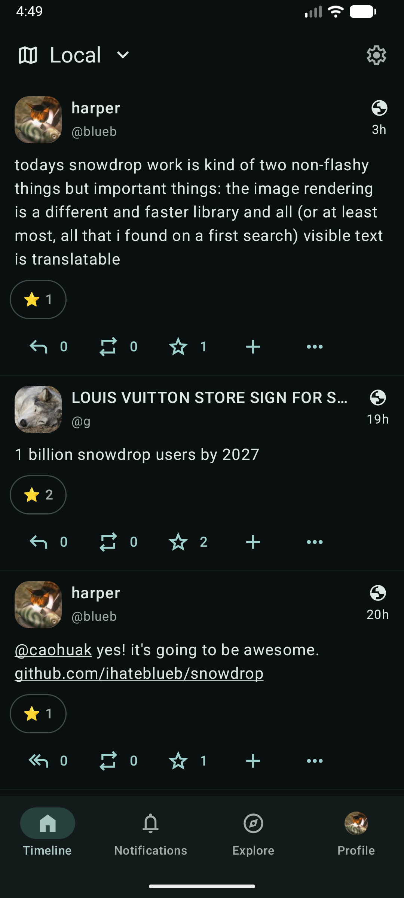
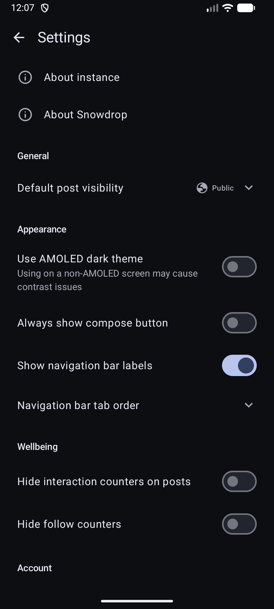

<h1>
    <picture>
        <source media="(prefers-color-scheme: dark)" srcset="branding/wordmark-white.svg">
        <source media="(prefers-color-scheme: light)" srcset="branding/wordmark-black.svg">
        
    </picture>
</h1>

 

An attempt to make a Mastodon client that is multiplatform (iOS and Android)
and supports extensions brought by Mastodon API compatible software
like Iceshrimp.NET.

Uses Material 3 (supporting dynamic color schemes) for UI and icons.

## Screenshots

	
	
	
	
	

## Contributing

You can see instructions and helpful tips on contributing in `./CONTRIBUTING.md`.
Pull requests are welcome! Translations can also be submitted on our [Weblate](https://translate.codeberg.org/engage/snowdrop/).

## Acknowledgments

Thank you to rabbithawk256 for creating Snowdrop's app icon!

## License

Copyright © 2026 Snowdrop Developers

This program is free software: you can redistribute it and/or modify it under the terms of the GNU Affero General Public License as published by the Free Software Foundation, either version 3 of the License, or (at your option) any later version.

This program is distributed in the hope that it will be useful, but WITHOUT ANY WARRANTY; without even the implied warranty of MERCHANTABILITY or FITNESS FOR A PARTICULAR PURPOSE. See the GNU Affero General Public License for more details.

You should have received a copy of the GNU Affero General Public License along with this program. If not, see <https://www.gnu.org/licenses/>. 
