<h1>
    <picture>
        <source media="(prefers-color-scheme: dark)" srcset="branding/wordmark-white.svg">
        <source media="(prefers-color-scheme: light)" srcset="branding/wordmark-black.svg">
        
    </picture>
</h1>

A Mastodon client that is multiplatform (iOS and Android) and supports extensions brought by
compatible software like Iceshrimp.NET.

Uses Compose Multiplatform, Kotlin, and Material 3 (supporting dynamic color schemes) for UI and
icons.

## Screenshots

	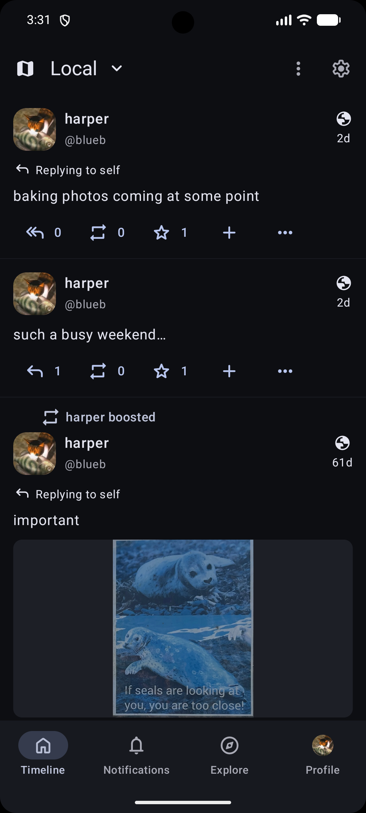
	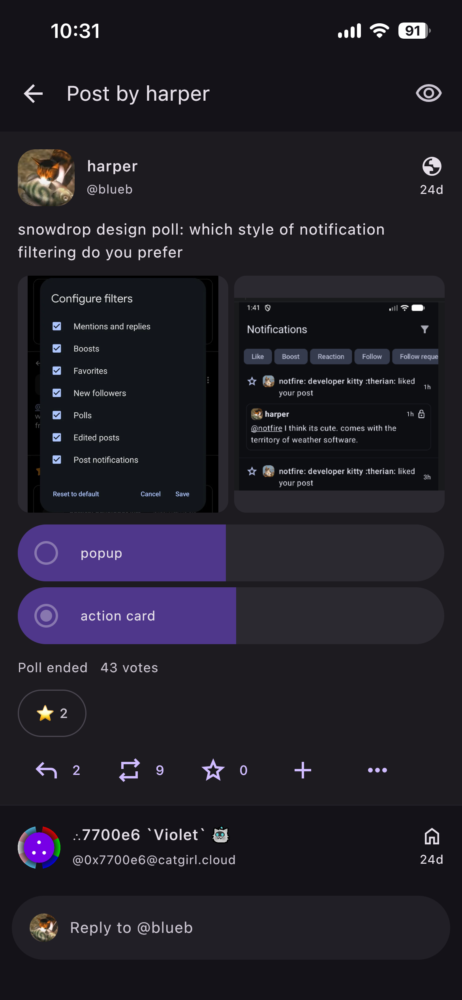
	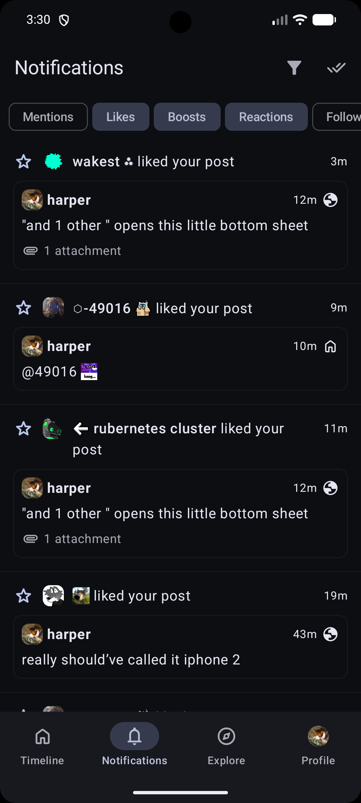
	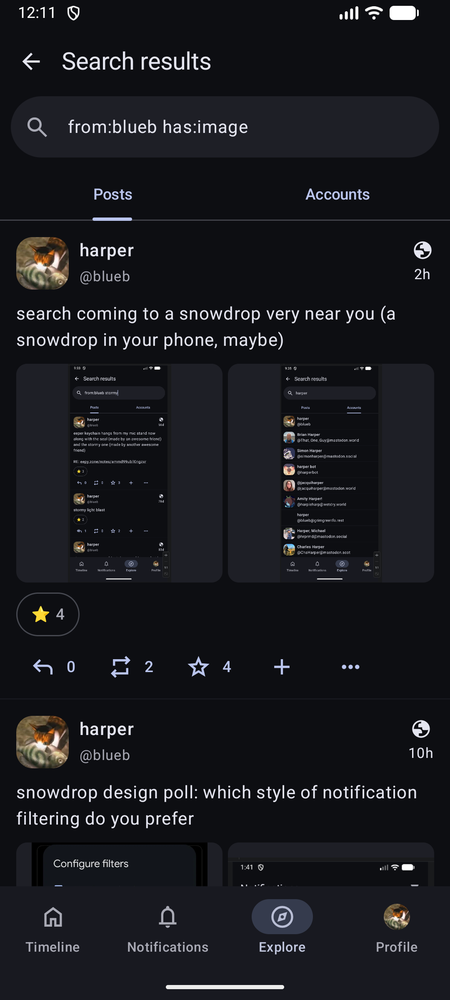
	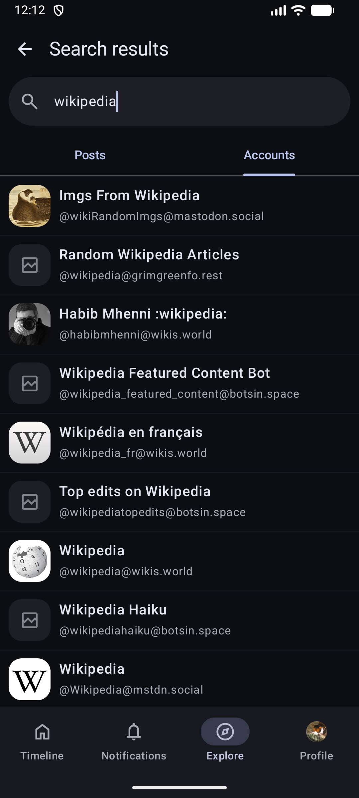
	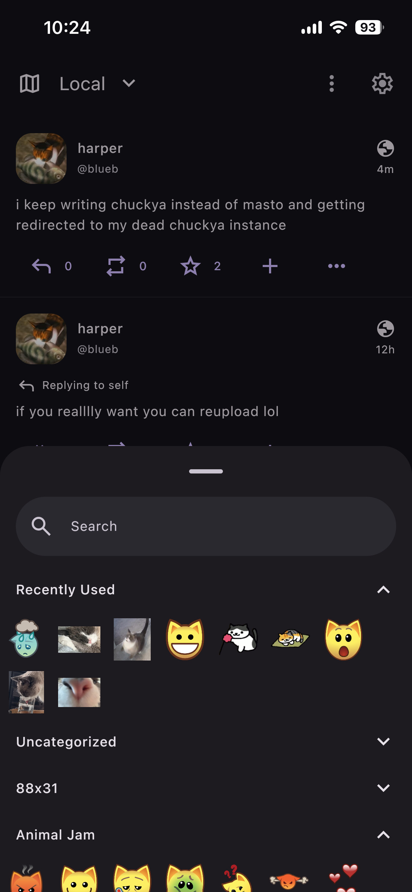
	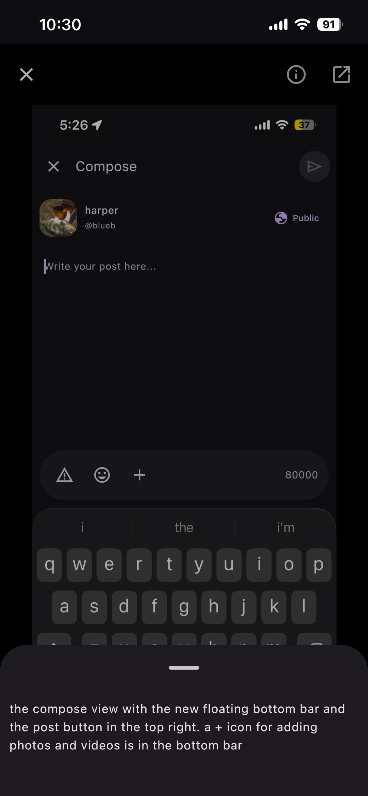
	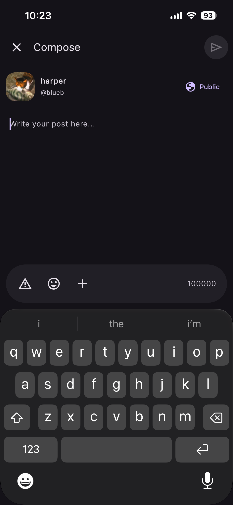
	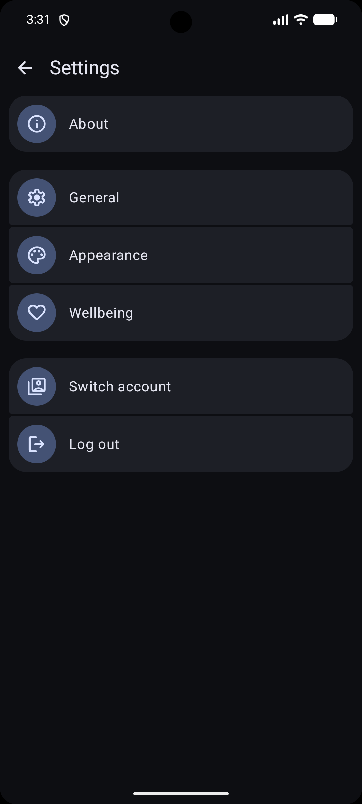
	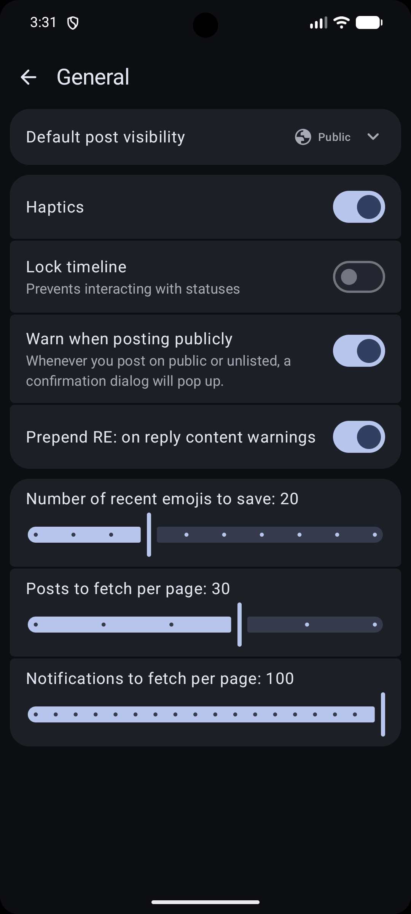
	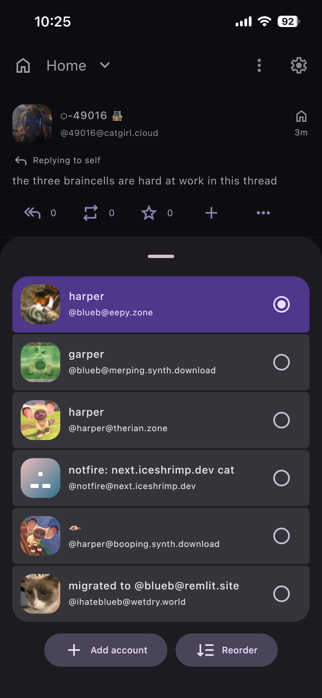
	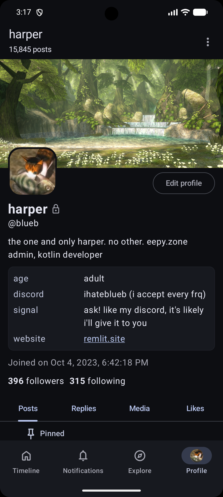
	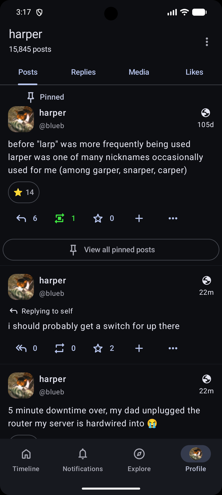

## Software Compatibility

| Software           | Supported | Status   | Notes                                                                                        |
|--------------------|-----------|----------|----------------------------------------------------------------------------------------------|
| Iceshrimp.NET      | Yes       | Great    |                                                                                              |
| Chuckya (Mastodon) | Yes       | Great    |                                                                                              |
| Glitch (Mastodon)  | Yes       | Great    |                                                                                              |
| Mastodon           | Yes       | Great    |                                                                                              |
| Iceshrimp.JS       | Yes       | Usable   | Some missing options compared to .NET but generally good.                                    |
| GoToSocial         | Yes       | Usable   | Not as frequently tested/used by developers.                                                 |
| Pleroma, Akkoma    | Yes       | Usable   | Not as frequently tested/used by developers.                                                 | 
| Friendica          | Yes       | Usable   | Not as frequently tested/used by developers. Has some quirks we don't currently account for. |
| Sharkey            | No        | Unusable | Poor Mastodon API implementation, technically logs in and allows browsing.                   |

Feel free to open an issue if there's something missing here, or if you have suggestions for software
to support.

## Contributing

You can see instructions and helpful tips on contributing in `./CONTRIBUTING.md`.
Pull requests are welcome! Translations can also be submitted on our [Weblate](https://translate.codeberg.org/engage/snowdrop/).

## Acknowledgments

Thank you to rabbithawk256 for creating Snowdrop's app icon!

## License

Copyright © 2026 Snowdrop Developers

This program is free software: you can redistribute it and/or modify it under the terms of the GNU Affero General Public License as published by the Free Software Foundation, either version 3 of the License, or (at your option) any later version.

This program is distributed in the hope that it will be useful, but WITHOUT ANY WARRANTY; without even the implied warranty of MERCHANTABILITY or FITNESS FOR A PARTICULAR PURPOSE. See the GNU Affero General Public License for more details.

You should have received a copy of the GNU Affero General Public License along with this program. If not, see <https://www.gnu.org/licenses/>. 
